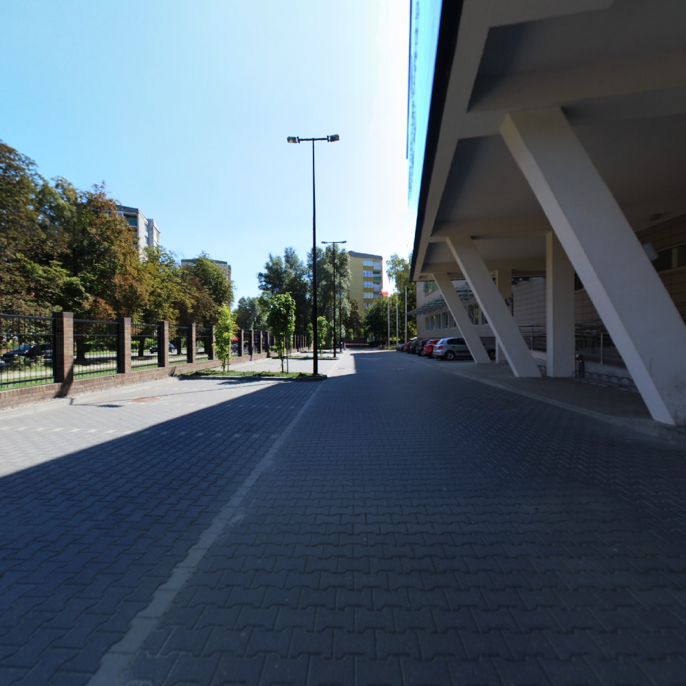

# OSFES
Operatings Systems for Embedded Systems

## Spherical photo to cubemap

### SPHERICAL


### Cubemap
<table>
  <tr>
    <td></td>
    <td></td>
    <td></td>
    <td></td>
   </tr> 
   
  <tr>
    <td></td>
    <td></td>
    <td></td>
    <td></td>
   </tr> 
   
   <tr>
    <td></td>
    <td></td>
    <td></td>
    <td></td>
   </tr> 
</table>


## Build

Run cmake (on Windows)
```
mkdir build
cd build
cmake -DCMAKE_BUILD_TYPE=Debug -G "CodeBlocks - MinGW Makefiles" ..
```

Build
```
make OSFES
```

## Run

```
OSFES.exe -s <source file path> -o <output directory path> -h
```


OSFES.exe -h
```
Spherical photo to cubemap
Usage:
  OSFES [OPTION...]

  -s, --source arg  Param source image (default:
                    .\img\original.jpg)
  -o, --output arg  Param output directory path (default:
                    .\img\original)
  -h, --help        Print usage
```
